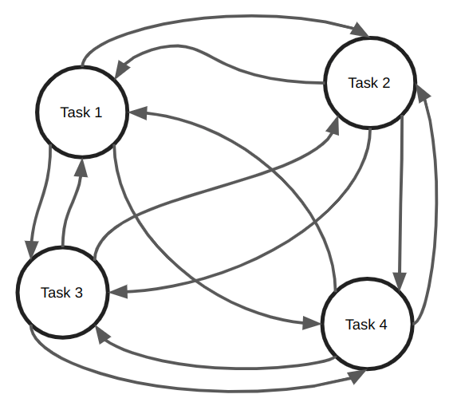
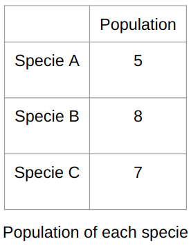
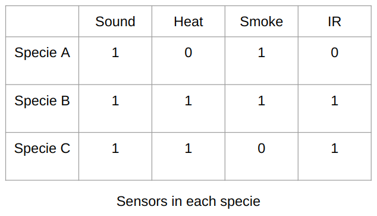
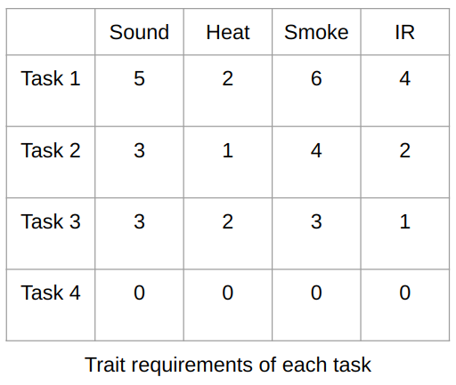
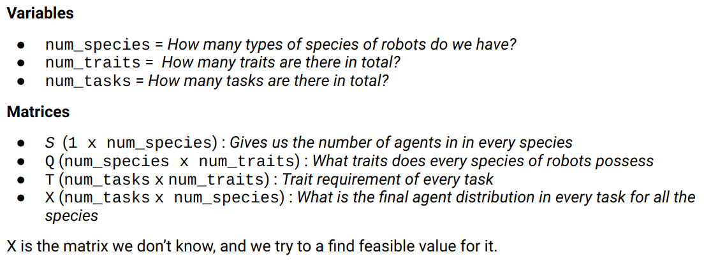
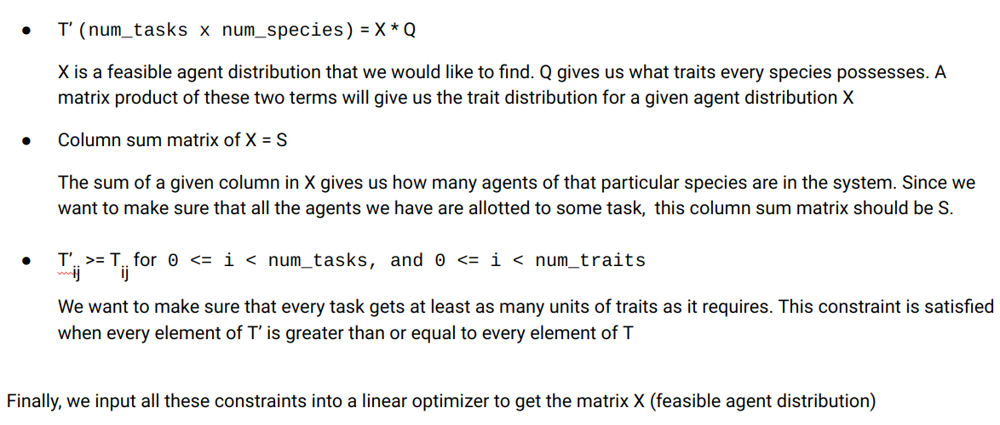
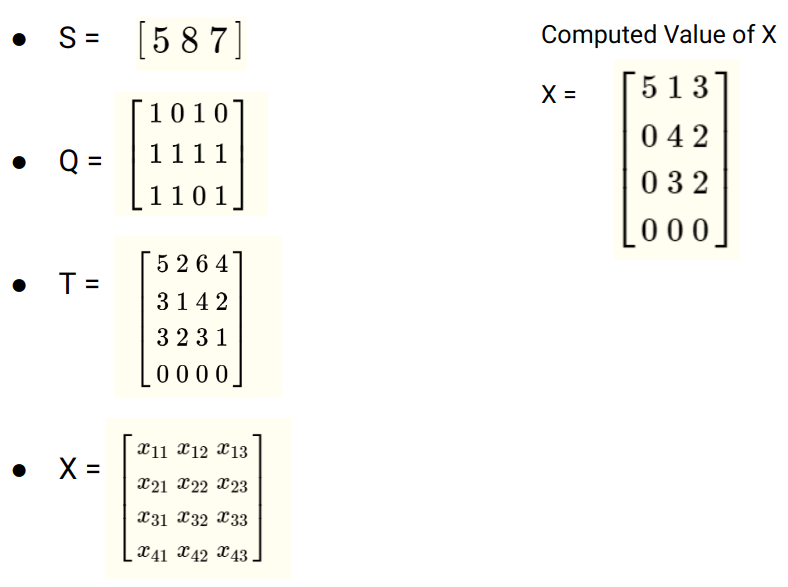
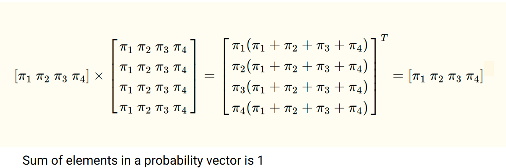
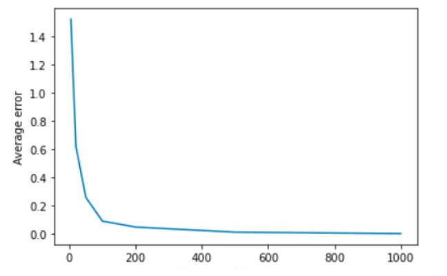

# Distribution of a Swarm of Heterogeneous Robots Across Tasks

This project uses a stochastic approach to distribute heterogenous agents across several task sites to fulfill the requirements at each site.

**keywords**: probabilistic task allocation, swarm robots

## Problem

Consider an evironment with $m$ tasks and $n$ robots. Each robot has specific traits (like qualities/abilities) that it can lend towards satisfying a task's requirements. The requirement of a task is a linear combination of all the traits that a robot can have. When a task is occupied by enough number of agents such that the total sum of the traits possessed by each agent exceed the requirements of that task, we say that that particular task has been satisfied. The possession of a trait by an agent is a binary quantity, that is, a robot either has that trait or it doesn't. A robot can have several traits.

We take the case of our robot population being partitioned into $s$ species, such that agents in each specie possess the same combination of traits. Our task then reduces to computing the distribution of agents from each specie among the $m$ tasks such that the trait requirements of each task are satisfied. This gives us the option to treat each species individually if need be.

As we would like to approach this problem for a very large number of agents, it is important to consider the costs of monitoring and maintaining agents when their number is in the order of 100s or 1000s of robots. Hence in such applications it is desirable to treat the distribution of agents across the tasks from a stochastic or probabilistic aspect that allows us to allocate agents to tasks such that any task's requirements get satisfied consistently *on average*. This also means that agents are free to switch tasks, ensuring a rotation of agents across tasks. This helps counter the effect of defective robots getting concentrated on the same task, or the effect the traits of identical robots being slightly different in practical cases.

If we treat each task as a state in a Markov Chain, our problem then becomes to **find a Transition Probability Matrix (TPM) for each specie such that the trait requirements of each task are satisfied in the steady state**.

The above figure represents 4 tasks as states in a Markov Chain. The weight of edge between 2 states signifies the probability of an agent transitioning between the states (not necessarily the same in both directions).

## Environment Setting
The following $S$ Matrix represents the number of agents in each species:

The following $Q$ Matrix represents the traits present in each species:

The following $T$ Matrix represents the trait requirements of each task in the system:

We must find a feasible agent distribution matrix across the tasks to satisfy the trait requirements of each task. We achieve this by formulating and then solving an Integer Problem.

## Formulating the Integer Problem

### Integer Problem Constraints

### Integer Problem Solution

### Computing the Transition Probability Matrix
Now that we have the desired distribution of agents across the tasks (steady-state agent distribution), we must compute the Transition Probability Matrix (TPM) that leads the agents to this distribution over time (on average).

We use the relation $\pi$$P_i$$=$$\pi$,
where $\pi$ is the steady-state distribution and $P_i$ is the TPM for an $i^{th}$ species.

At steady state, the probability distribution remains unchanged in the Markov chain, even after transitions occur.

We use the following result:

Which means $P_i$ can simply take a feasible value of each row being equal to $\pi$.

## Simulation
This repository computes the TPMs for each species and simualates them to empirically test the validity of our results.

We find that the 2-norm of the difference between the steady state distribution achieved through simulation and the steady state distribtion achieved through computation drops drastically as the number of transitions increases, thereby verifying the validity of our results.

## Significance of Probabilistic Treatment
- In a large scale situation, some agents are bound to defect.
- Due to there being a large number of agents and tasks, it can be impractical to keep a track on the status of all the agents.
- One way to work around this is to keep rotating the agents to different tasks.
- This spreads out the number of tasks the defective agent touches and lowers the chance of a task having constant number of defective agents.
- Allows the non-defective agents to touch the tasks which previously had defective ones.
- When there are many agents and tasks (order of 1000s of agents), allocation of agents to tasks using deterministic methods can prove to be computationally expensive.
- Probabilistic treatment reduces this computation by leaving it up to the agents to transition from task to task based on the TPM (which only needs to be computed once).
- Using this method, we can eliminate having to monitor the status and micromanagement of the agents.
